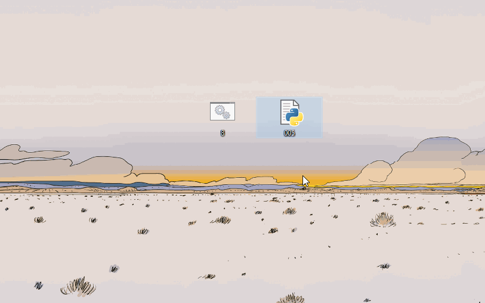

# files-with-incrementable-names
 Simple counters you interact it with by clicking on them to increment their number-representing names by 1.

## Example usage:
- you can put it in a folder with a downloaded series to easily track episodes you've watched

## How it works:

